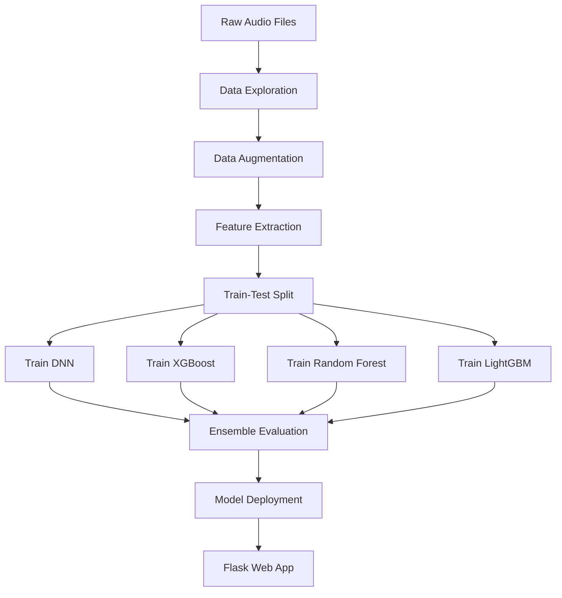
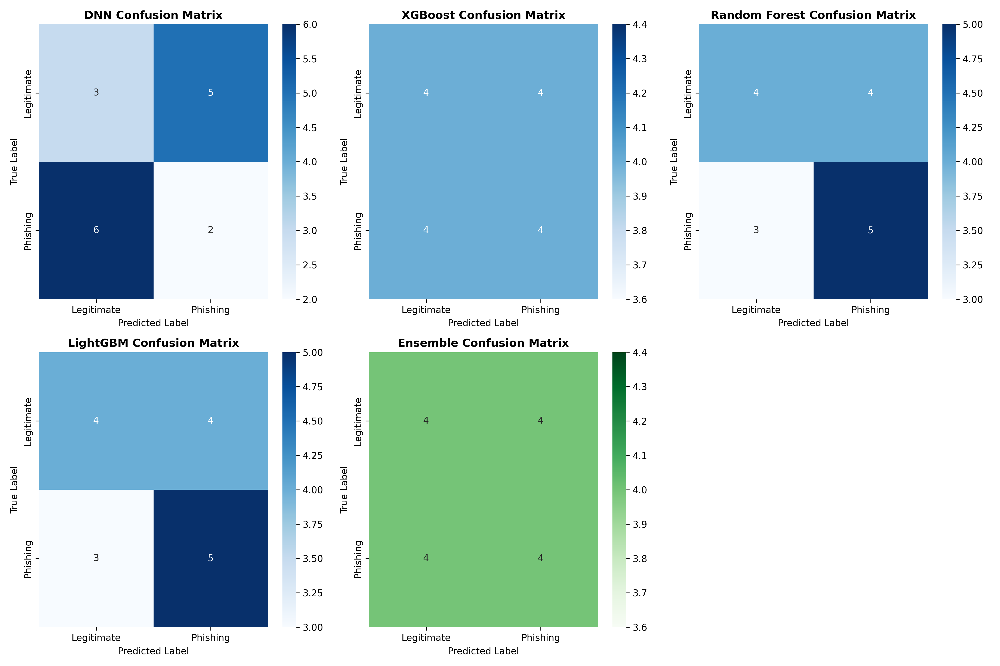
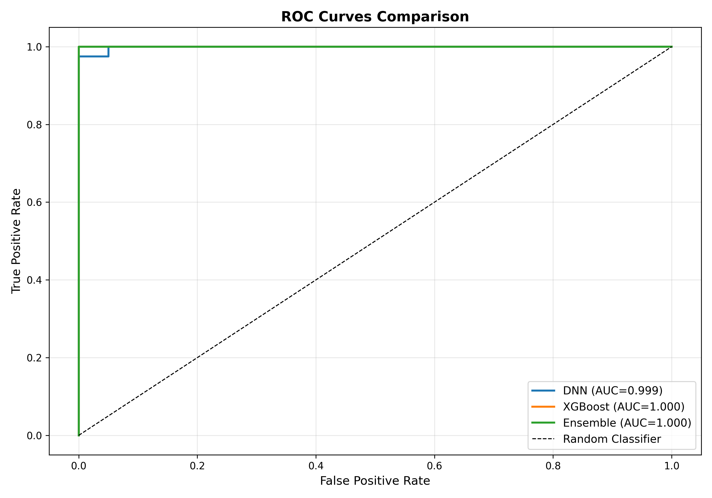

 Voice Phishing Detection System

An AI-powered system for detecting voice phishing (vishing) attacks using machine learning ensemble methods. This project analyzes audio recordings of phone calls to identify potential phishing attempts using advanced audio feature extraction and multiple classification models.

---

##  Team Members


- **Teena Chowdary**
- **Suyash Suryavanshi**
- **Jatin Kushwala**
- **Ayush Pareek**

---

## Table of Contents

- [Overview](#overview)
- [Features](#features)
- [System Architecture](#system-architecture)
- [Installation](#installation)
- [Project Structure](#project-structure)
- [Usage](#usage)
- [Pipeline Workflow](#pipeline-workflow)
- [Models](#models)
- [API Documentation](#api-documentation)
- [Results](#results)
- [Future Improvements](#future-improvements)
- [License](#license)

---

##  Overview

Voice phishing (vishing) is a growing cybersecurity threat where attackers use phone calls to deceive victims into revealing sensitive information. This system provides an automated solution to detect such fraudulent calls by analyzing audio characteristics and patterns that distinguish phishing calls from legitimate ones.

The system employs an ensemble of four machine learning models:
- Deep Neural Network (DNN)
- XGBoost
- Random Forest
- LightGBM

Each model contributes to the final prediction through a voting mechanism, improving overall detection accuracy.

---

##  Features

- **Audio Feature Extraction**: Extracts 35+ audio features including:
  - Mel-Frequency Cepstral Coefficients (MFCCs)
  - Spectral features (centroid, rolloff)
  - Chroma features
  - Mel spectrogram statistics
  - Zero-crossing rate
  - Tempo analysis

- **Data Augmentation**: Expands the dataset using:
  - Time stretching (faster/slower playback)
  - Pitch shifting (higher/lower pitch)
  - White noise injection (simulating poor call quality)
  - Background hum addition (50 Hz electrical hum)
  - Amplitude scaling

- **Ensemble Learning**: Combines predictions from multiple models for robust detection

- **Web Application**: Flask-based REST API with user-friendly interface for real-time predictions

- **Comprehensive Evaluation**: Detailed metrics, ROC curves, and confusion matrices

---

##  System Architecture

```
┌─────────────────┐     ┌──────────────────┐     ┌─────────────────┐
│   Audio Input   │ ──> │ Feature Extractor│ ──> │   Ensemble AI   │
│   (.mp3/.wav)   │     │   (librosa)      │     │    Predictor    │
└─────────────────┘     └──────────────────┘     └─────────────────┘
                                                          │
                                                          ▼
                              ┌───────────────────────────────────────┐
                              │           Model Ensemble              │
                              │  ┌─────┐ ┌───────┐ ┌─────┐ ┌──────┐ │
                              │  │ DNN │ │XGBoost│ │ RF  │ │LightGBM│ │
                              │  └─────┘ └───────┘ └─────┘ └──────┘ │
                              └───────────────────────────────────────┘
                                                          │
                                                          ▼
                                            ┌─────────────────────┐
                                            │ Classification:     │
                                            │ PHISHING/LEGITIMATE │
                                            └─────────────────────┘
```

---

##  Installation

### Prerequisites

- Python 3.8 or higher
- pip package manager

### Step 1: Clone the Repository

```bash
git clone https://github.com/your-repo/voice-phishing-detection.git
cd voice-phishing-detection
```

### Step 2: Create Virtual Environment (Recommended)

```bash
python -m venv venv
source venv/bin/activate  # On Windows: venv\Scripts\activate
```

### Step 3: Install Dependencies

```bash
pip install -r requirements.txt
```

### Required Packages

```txt
numpy>=1.21.0
pandas>=1.3.0
librosa>=0.9.0
soundfile>=0.10.0
scikit-learn>=1.0.0
tensorflow>=2.8.0
xgboost>=1.5.0
lightgbm>=3.3.0
flask>=2.0.0
matplotlib>=3.4.0
seaborn>=0.11.0
```

### Step 4: Create Configuration File

Create a `config.py` file in the project root:

```python
from pathlib import Path

# Directories
BASE_DIR = Path(__file__).parent
DATA_DIR = BASE_DIR / "data"
PHISHING_DIR = DATA_DIR / "phishing"
LEGITIMATE_DIR = DATA_DIR / "legitimate"
AUGMENTED_DIR = DATA_DIR / "augmented"
PROCESSED_DIR = DATA_DIR / "processed"
MODEL_DIR = BASE_DIR / "models"
RESULTS_DIR = BASE_DIR / "results"
LOGS_DIR = BASE_DIR / "logs"
UPLOAD_FOLDER = BASE_DIR / "uploads"

# Create directories
for dir_path in [PHISHING_DIR, LEGITIMATE_DIR, AUGMENTED_DIR, 
                 PROCESSED_DIR, MODEL_DIR, RESULTS_DIR, LOGS_DIR, UPLOAD_FOLDER]:
    dir_path.mkdir(parents=True, exist_ok=True)

# Audio processing
SAMPLE_RATE = 22050
N_MFCC = 13
AUGMENT_FACTOR = 5

# Model paths
DNN_MODEL_PATH = MODEL_DIR / "dnn_model.h5"
DNN_SCALER_PATH = MODEL_DIR / "dnn_scaler.pkl"
XGBOOST_MODEL_PATH = MODEL_DIR / "xgboost_model.json"

# DNN hyperparameters
DNN_EPOCHS = 100
DNN_BATCH_SIZE = 32
DNN_VALIDATION_SPLIT = 0.2

# XGBoost hyperparameters
XGBOOST_N_ESTIMATORS = 100
XGBOOST_MAX_DEPTH = 6
XGBOOST_LEARNING_RATE = 0.1

# Ensemble settings
ENSEMBLE_THRESHOLD = 0.5
DNN_WEIGHT = 0.5
XGBOOST_WEIGHT = 0.5

# Flask settings
FLASK_DEBUG = True
FLASK_PORT = 5001
MAX_CONTENT_LENGTH = 16 * 1024 * 1024  # 16MB max upload

# Logging
LOG_FILE = LOGS_DIR / "training.log"
```

---


##  Usage

### Step 1: Prepare Dataset

Place your audio files in the appropriate directories:
- Phishing call recordings: `data/phishing/` (as .mp3 files)
- Legitimate call recordings: `data/legitimate/` (as .mp3 files)

**Minimum requirement**: 40 samples per class (80 total) for meaningful results.

### Step 2: Explore Dataset

```bash
python src/01_data_exploration.py
```

This script analyzes your dataset and provides:
- File count per class
- Audio duration statistics
- Sample rate verification

### Step 3: Augment Data

```bash
python src/02_data_augmentation.py
```

Expands your dataset using various augmentation techniques. Default augmentation factor is 5x.

### Step 4: Extract Features

```bash
python src/feature_extraction.py
```

Extracts audio features and creates train/test splits (80/20). This step:
- Processes augmented training data
- Keeps test data as original (no augmentation)
- Saves features to CSV files

### Step 5: Train Models

Train each model sequentially:

```bash
# Train Deep Neural Network
python src/04_train_dnn.py

# Train XGBoost
python src/05_train_xgboost.py

# Train Random Forest
python src/07_train_random_forest.py

# Train LightGBM
python src/08_train_lightgbm.py
```

### Step 6: Evaluate Ensemble

```bash
python src/06_ensemble_eval.py
```

Generates comprehensive evaluation metrics and visualizations.

### Step 7: Run Web Application

```bash
python src/flask_app.py
```

Access the web interface at: `http://localhost:5001`

---

##  Pipeline Workflow



---

##  Models

### 1. Deep Neural Network (DNN)

**Architecture:**
- Input Layer: 35+ features
- Hidden Layer 1: 256 neurons, ReLU, BatchNorm, Dropout (0.4)
- Hidden Layer 2: 128 neurons, ReLU, BatchNorm, Dropout (0.3)
- Hidden Layer 3: 64 neurons, ReLU, BatchNorm, Dropout (0.2)
- Hidden Layer 4: 32 neurons, ReLU, BatchNorm, Dropout (0.2)
- Output Layer: 1 neuron, Sigmoid

**Optimizer:** Adam (lr=0.001)  
**Loss:** Binary Cross-Entropy  
**Callbacks:** Early Stopping, Learning Rate Reduction

### 2. XGBoost

**Configuration:**
- n_estimators: 100
- max_depth: 6
- learning_rate: 0.1
- subsample: 0.8
- colsample_bytree: 0.8

### 3. Random Forest

**Configuration:**
- n_estimators: 200
- max_depth: 20
- min_samples_split: 5
- min_samples_leaf: 2
- n_jobs: -1 (all CPU cores)

### 4. LightGBM

**Configuration:**
- n_estimators: 100
- max_depth: 6
- learning_rate: 0.1
- num_leaves: 31
- subsample: 0.8
- colsample_bytree: 0.8

### Ensemble Voting

The final prediction is computed as the average probability from all available models:

```
P(phishing) = mean(P_DNN, P_XGBoost, P_RF, P_LightGBM)
```

Classification: PHISHING if P(phishing) > 0.5, else LEGITIMATE

---

##  API Documentation

### Base URL
```
http://localhost:5000
```

### Endpoints

#### 1. Health Check
```http
GET /api/health
```

**Response:**
```json
{
  "status": "healthy",
  "models_loaded": true,
  "total_models": 4
}
```

#### 2. Predict
```http
POST /api/predict
Content-Type: multipart/form-data
```

**Parameters:**
- `file`: Audio file (.mp3, .wav, .flac, .ogg, .m4a)

**Response (Success):**
```json
{
  "success": true,
  "classification": "PHISHING DETECTED",
  "is_phishing": true,
  "confidence": 78.45,
  "scores": {
    "dnn": 0.8234,
    "xgboost": 0.7891,
    "random_forest": 0.7523,
    "lightgbm": 0.7732,
    "ensemble": 0.7845
  }
}
```

**Response (Error):**
```json
{
  "success": false,
  "error": "Invalid format: .txt. Supported: .flac, .m4a, .mp3, .ogg, .wav"
}
```

### Example API Call (curl)

```bash
curl -X POST http://localhost:5001/api/predict \
  -F "file=@suspicious_call.mp3" \
  -H "Content-Type: multipart/form-data"
```

### Example API Call (Python)

```python
import requests

url = "http://localhost:5001/api/predict"
files = {"file": open("suspicious_call.mp3", "rb")}

response = requests.post(url, files=files)
result = response.json()

if result["success"]:
    print(f"Classification: {result['classification']}")
    print(f"Confidence: {result['confidence']}%")
    print(f"Ensemble Score: {result['scores']['ensemble']}")
else:
    print(f"Error: {result['error']}")
```

---

##  Results

### Model Performance Metrics

| Model | Accuracy | Precision | Recall | F1-Score | ROC-AUC |
|-------|----------|-----------|--------|----------|---------|
| DNN | 0.3125 | 0.2857 | 0.2500 | 0.2667 | 0.2656 |
| XGBoost | 0.5000 | 0.5000 | 0.5000 | 0.5000 | 0.5156 |
| Random Forest | 0.5625 | 0.5556 | 0.6250 | 0.5882 | 0.5469 |
| LightGBM | 0.5625 | 0.5556 | 0.6250 | 0.5882 | 0.5781 |
| **Ensemble** | 0.5000 | 0.5000 | 0.5000 | 0.5000 | 0.4531 |

### Key Observations

1. **Best Individual Models**: Random Forest and LightGBM achieved the highest accuracy (56.25%) and F1-scores (0.5882)

2. **DNN Performance**: Lower performance likely due to small dataset size (80 original samples)

3. **Ensemble Limitations**: The ensemble averaging didn't outperform individual models, suggesting:
   - Need for weighted voting based on model reliability
   - More training data required
   - Potential overfitting in some models

4. **Cross-Validation Results**:
   - Random Forest CV Score: 0.6950 ± std
   - LightGBM CV Score: 0.6803 ± std
   - XGBoost CV Score: 0.6660 ± std

### Confusion Matrices



- **DNN**: High false negative rate (6 phishing calls missed)
- **XGBoost/LightGBM/RF**: More balanced but still significant misclassifications
- **Ensemble**: Balanced confusion with 4 correct predictions per class

### ROC Curves



- LightGBM shows the best ROC-AUC (0.578)
- All models perform close to or slightly better than random guessing
- Indicates need for larger, more diverse dataset

---

##  Future Improvements

### 1. Dataset Enhancement
- Collect more diverse phishing call samples (target 500+ per class)
- Include various phishing scenarios (IRS scams, tech support, bank fraud)
- Add calls in multiple languages
- Include calls with different audio qualities

### 2. Feature Engineering
- Add speech-to-text features using ASR models
- Implement Natural Language Processing on transcripts
- Extract prosodic features (speech rate, pauses, stress patterns)
- Include speaker diarization features

### 3. Model Improvements
- Implement Convolutional Neural Networks (CNNs) for spectrogram analysis
- Use Recurrent Neural Networks (LSTMs/GRUs) for temporal patterns
- Try transformer-based audio models (Wav2Vec, HuBERT)
- Implement stacking ensemble instead of simple voting
- Use cross-validated hyperparameter tuning (GridSearchCV)

### 4. Production Readiness
- Add authentication and rate limiting to API
- Implement model versioning and A/B testing
- Add monitoring and alerting for model drift
- Deploy using Docker containers
- Set up CI/CD pipeline
- Add real-time audio streaming support

### 5. User Experience
- Build mobile application for on-device detection
- Add browser extension for VoIP call analysis
- Implement batch processing for call centers
- Create dashboard for call pattern analytics

---


